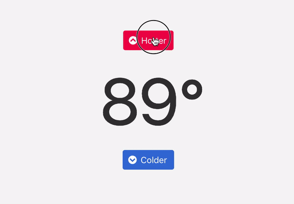

# Stimulus Thermostat

A toy Thermostat static web application that demonstrates using [StimulusJS](https://stimulusjs.org/). Built for the purposes of learning how to apply Stimulus in applicable scenarios were 'sprinkling' is suitable.

You can try out the application here: [https://stimulus-thermostat.netlify.com/](https://stimulus-thermostat.netlify.com/)

# Deployment

A simple deployment to [Netlify](https://www.netlify.com/) was sufficient and easy!

# Testing

Tests were built using [Jest](https://jestjs.io/) and applies information provided [here by Hrvoje Šimić](https://shime.sh/testing-stimulus).

